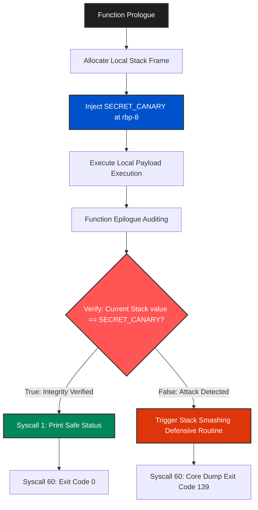

# Boutaba-Kernel-Stack-Canary-PoC v1.0

## Overview
**Boutaba-Kernel-Stack-Canary-PoC** is a low-level microarchitectural mitigation utility engineered in **Pure x86_64 Assembly** for Linux systems. The project serves as a safe Proof-of-Concept (PoC) illustrating custom Stack Canary injection and verification algorithms to proactively defend software runtimes against buffer overflow and stack-smashing exploits without relying on compiler-generated extensions.

---

## Architecture & Structural Execution Flow

The framework allocates a cryptographic sentinel token (Canary) directly on the local stack frame during initialization. Before returning from the active routine, the architecture re-evaluates the integrity of the token via hardware-level registers.

## Specifications
- **Language:** Pure Assembly (x86_64 ASM 100.0%)
- **Target Subsystem:** Ring 3 Process Space interacting with Linux Kernel ABI.
- **Security Scope:** Anti-Exploitation, Memory Integrity Protection.

---
*Developed and maintained by **Boutaba Motezeballah** — Systems Architect & Reverse Engineer.*
