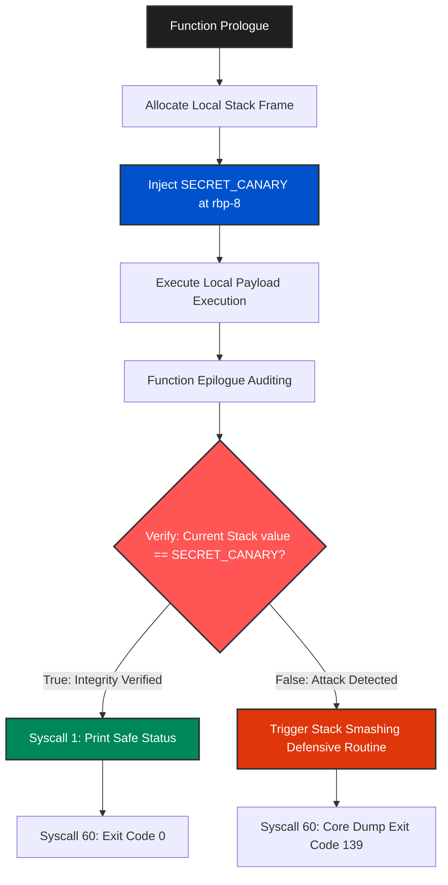

# Boutaba-Kernel-Stack-Canary-PoC v1.0

## Overview
**Boutaba-Kernel-Stack-Canary-PoC** is a low-level microarchitectural mitigation utility engineered in **Pure x86_64 Assembly** for Linux systems. The project serves as a safe Proof-of-Concept (PoC) illustrating custom Stack Canary injection and verification algorithms to proactively defend software runtimes against buffer overflow and stack-smashing exploits without relying on compiler-generated extensions.

---

## Architecture & Structural Execution Flow

The framework allocates a cryptographic sentinel token (Canary) directly on the local stack frame during initialization. Before returning from the active routine, the architecture re-evaluates the integrity of the token via hardware-level registers.



---

## Pure Assembly Code Implementation (`canary.asm`)

```assembly
; ==============================================================================
;  Project: Boutaba-Kernel-Stack-Canary-PoC v1.0
;  Developer: Boutaba Motezeballah — Systems Architect & Reverse Engineer
;  Architecture: x86_64 ASM (Linux Platform)
;  Description: Custom Stack Canary verification layer to prevent memory corruption.
; ==============================================================================

section .data
    msg_ok       db "Buffer integrity verified. Stack Canary is safe.", 10
    len_ok       equ \$ - msg_ok

    msg_corrupt  db "CRITICAL ALERT: Stack buffer corruption detected! Purging...", 10
    len_corrupt  equ \$ - msg_corrupt

    SECRET_CANARY equ 0xDEADBEEFCAFEF00D 

section .text
    global _start

_start:
    ; 1. Stack Prologue & Canary Injection
    push rbp
    mov rbp, rsp
    sub rsp, 16             
    
    mov rax, SECRET_CANARY  
    mov [rbp - 8], rax      

    ; [Local payload execution simulated here]
    ; If an exploitation occurs, the location [rbp - 8] is overwritten first

    ; 2. Verification Layer before Epilogue
    mov rdx, [rbp - 8]      
    mov rax, SECRET_CANARY  
    cmp rdx, rax            
    jne .stack_corrupted    

    ; 3. Safe Path (INTEGRITY OK)
    mov rax, 1              ; syscall: sys_write
    mov rdi, 1              ; stdout
    mov rsi, msg_ok
    mov rdx, len_ok
    syscall

    ; Safe Exit Execution
    mov rsp, rbp
    pop rbp
    mov rax, 60             ; syscall: sys_exit
    xor rdi, rdi
    syscall

.stack_corrupted:
    ; 4. Defensive Action Path (PURGE)
    mov rax, 1              ; syscall: sys_write
    mov rdi, 1              ; stdout
    mov rsi, msg_corrupt
    mov rdx, len_corrupt
    syscall

    ; Force dynamic process termination with SIGSEGV (Exit code 139)
    mov rax, 60             ; syscall: sys_exit
    mov rdi, 139            
    syscall
```

---

## Deployment & Verification

```bash
# Assemble the source architecture into ELF64 structure
nasm -f elf64 canary.asm -o canary.o

# Bind object structures into static executable binary
ld canary.o -o boutaba_canary

# Clear internal symbol layers to ensure operational safety
strip --strip-all boutaba_canary
```

---

## Specifications
- **Language:** Pure Assembly (x86_64 ASM 100.0%)
- **Target Subsystem:** Ring 3 Process Space interacting with Linux Kernel ABI.
- **Security Scope:** Anti-Exploitation, Memory Integrity Protection.

---
*Developed and maintained by **Boutaba Motezeballah** — Systems Architect & Reverse Engineer.*
